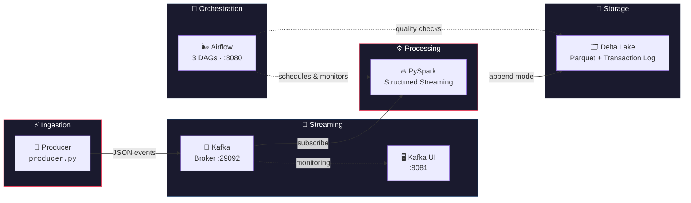
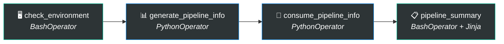
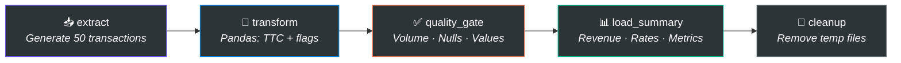
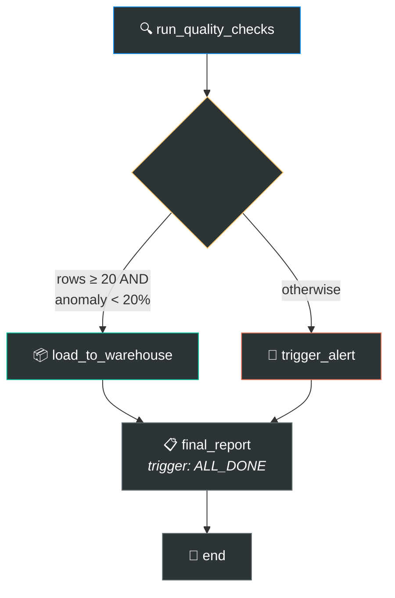

<p align="center">
  
  
  
  
  
  
</p>

<h1 align="center">🏗️ Data Engineering Project</h1>

<p align="center">
  <strong>End-to-end streaming data pipeline for e-commerce transactions</strong><br>
  <em>Month 1 — Foundations · Big Data Engineer Learning Path</em>
</p>

<p align="center">
  <a href="#-architecture">Architecture</a> •
  <a href="#-tech-stack">Tech Stack</a> •
  <a href="#-project-structure">Structure</a> •
  <a href="#-getting-started">Getting Started</a> •
  <a href="#-airflow-dags">DAGs</a> •
  <a href="#-progress">Progress</a>
</p>

---

## 🏛️ Architecture



### Data Flow

```
🛒 E-commerce Transaction
│
├──▶ Producer generates JSON ──▶ Kafka topic: transactions_ecommerce
│                                       │
│                                       ▼
│                              PySpark reads stream
│                              ├── Parse JSON schema
│                              ├── Add processing_timestamp
│                              └── Write to Delta Lake (append)
│
└──▶ Airflow DAGs
     ├── DAG 01: Environment check + XCom demo
     ├── DAG 02: ETL pipeline + quality gate
     └── DAG 03: Branching based on data quality
```

---

## 🛠️ Tech Stack

| Component | Version | Role |
|:---------:|:-------:|:-----|
|  | `3.12` | Core language |
|  | `3.5.1` | Stream processing |
|  | `3.1.0` | ACID storage layer |
|  | `7.3.0` | Message broker (Confluent) |
|  | `2.9.1` | Workflow orchestration |
|  | `2.2.2` | Data transformation |
|  | `v2` | Containerization |

---

## 📁 Project Structure

```
data-engineering-project/
│
├── 📂 dags/                                  ← Airflow DAG definitions
│   ├── dag_01_hello_world.py                    BashOperator · XCom · Jinja
│   ├── dag_02_ecommerce_etl.py                  Extract → Transform → Quality Gate → Load
│   └── dag_03_data_quality_branching.py          BranchPythonOperator routing
│
├── 📂 scripts/                               ← Streaming pipeline scripts
│   ├── producer.py                              Kafka producer (JSON, partitioned by user_id)
│   └── consumer.py                              PySpark Structured Streaming → Delta Lake
│
├── 📂 delta/                                 ← Generated data (git-ignored)
│   ├── output/                                  Delta table (parquet + _delta_log/)
│   └── checkpoints/                             Spark streaming checkpoints
│
├── 📂 config/                                ← Airflow configuration
├── 📂 plugins/                               ← Airflow plugins
├── 📂 logs/                                  ← Airflow logs (git-ignored)
│
├── 🐳 docker-compose.yaml                   ← Airflow (CeleryExecutor + Postgres + Redis)
├── 🐳 docker-compose-kafka.yml              ← Kafka + Zookeeper + Kafka UI
├── 📄 requirements.txt                       ← Python dependencies (pinned)
├── 📄 .env.example                           ← Environment variable template
├── 📄 .gitignore                             ← Excludes delta/, logs/, .env, etc.
└── 📄 README.md
```

---

## 🚀 Getting Started

### Prerequisites

| Requirement | Why |
|-------------|-----|
| **Docker Desktop** | Runs Kafka, Airflow, Postgres, Redis |
| **Python 3.12+** | Producer & Spark scripts |
| **Java 8 or 11** | PySpark runtime |
| **Hadoop winutils** | Windows only — set `HADOOP_HOME` |

### 1️⃣ Clone & Configure

```bash
git clone https://github.com/MdAbdehakim/data-engineering-project.git
cd data-engineering-project
cp .env.example .env
```

### 2️⃣ Start Kafka

```bash
docker compose -f docker-compose-kafka.yml up -d
```

> **Kafka UI** → [http://localhost:8081](http://localhost:8081)

### 3️⃣ Start Airflow

```bash
echo "AIRFLOW_UID=50000" > .env
docker compose up -d
```

> **Airflow UI** → [http://localhost:8080](http://localhost:8080) — login: `airflow` / `airflow`

### 4️⃣ Run the Pipeline

```bash
# Terminal 1 — Start producing events
python scripts/producer.py

# Terminal 2 — Start consuming & writing to Delta Lake
python scripts/consumer.py
```

### 5️⃣ Reset Delta Lake (after schema changes)

```bash
# Windows (Admin PowerShell)
Remove-Item -Recurse -Force delta\checkpoints, delta\output

# Linux / macOS
rm -rf delta/checkpoints delta/output
```

---

## 🌬️ Airflow DAGs

### DAG 01 — Hello World



**Concepts:** `BashOperator` • `PythonOperator` • XCom push/pull • Jinja templating

---

### DAG 02 — E-commerce ETL Pipeline



**Concepts:** ETL pattern • Quality gates • XCom data passing • Pandas transforms

---

### DAG 03 — Data Quality Branching



**Concepts:** `BranchPythonOperator` • `TriggerRule.ALL_DONE` • Conditional routing • Alert simulation

---

## 📊 Progress

| Phase | Description | Status | Progress |
|:-----:|:------------|:------:|:--------:|
| **1** | Airflow DAGs (BashOp, PythonOp, XCom, Branch) | ✅ Done | `████████████` 100% |
| **2** | Kafka (Producer + Topic + Kafka UI) | ✅ Done | `████████████` 100% |
| **3** | Delta Lake (PySpark Streaming → Parquet) | ✅ Done | `███████████░` 95% |
| **4** | Full Pipeline (Unified Docker Compose) | 🔴 TODO | `░░░░░░░░░░░░` 0% |

---

## 📊 Transaction Schema

```json
{
  "id_transaction": "550e8400-e29b-41d4-a716-446655440000",
  "user_id": 42,
  "montant": 150.75,
  "methode_paiement": "Carte Bancaire",
  "statut": "SUCCESS",
  "event_timestamp": "2026-07-17T10:30:00.000000"
}
```

| Field | Type | Description |
|-------|------|-------------|
| `id_transaction` | `string (UUID)` | Unique transaction ID |
| `user_id` | `int [1-100]` | Customer ID — used as Kafka partition key |
| `montant` | `float [10-500]` | Transaction amount in EUR |
| `methode_paiement` | `string` | `Carte Bancaire` · `PayPal` · `Virement` |
| `statut` | `string` | `SUCCESS` (90%) · `FAILED` (10%) |
| `event_timestamp` | `string (ISO)` | UTC timestamp of the event |

---

## ⚙️ Environment Variables

Copy `.env.example` → `.env` and adjust:

| Variable | Default | Description |
|----------|---------|-------------|
| `HADOOP_HOME` | `./hadoop` | Path to Hadoop binaries |
| `KAFKA_BOOTSTRAP_SERVERS` | `localhost:29092` | Kafka broker address |
| `KAFKA_TOPIC` | `transactions_ecommerce` | Topic name |
| `DELTA_OUTPUT_PATH` | `./delta/output` | Delta table directory |
| `DELTA_CHECKPOINT_PATH` | `./delta/checkpoints` | Streaming checkpoint dir |
| `SPARK_KAFKA_PACKAGE` | `org.apache.spark:spark-sql-kafka-0-10_2.12:3.5.1` | Spark-Kafka connector |
| `DELTA_SPARK_PACKAGE` | `io.delta:delta-spark_2.12:3.1.0` | Delta-Spark connector |
| `AIRFLOW_UID` | `50000` | Linux UID for Airflow containers |

---

## 👤 Author

**Abdelhakim Mahdad**

<p>
  <a href="https://github.com/MdAbdehakim"></a>
</p>

---

<p align="center">
  <sub>Built with ☕ and determination — Month 1 of the Big Data Engineer journey</sub>
</p>
